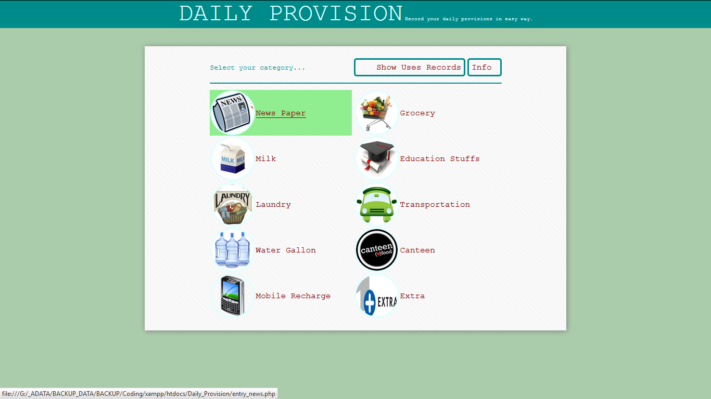
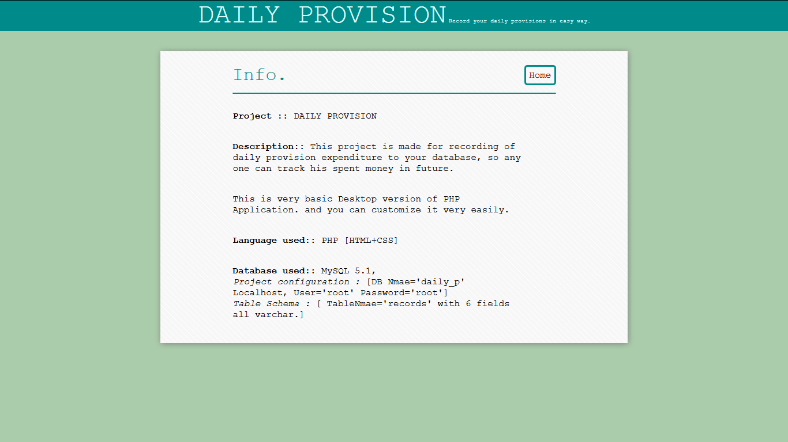

#Daily_Provision
It stores all your daily base expenditure to your database with clean UI.
Its a basic Desktop (PHP+MySQL+HTML+CSS)Application.

#Application Setup
For this application you will need PHP 5 and MySQL 5.

#ScreenShots

  
  

